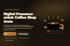

# DOKUMENTASI TEKNIS & LAPORAN AKHIR KERJA PRAKTIK (KP)

## Project: **KopiWeb** — Website Pemasaran & Katalog Jasa Pembuatan Website Coffee Shop

> Dokumen ini disusun berdasarkan **kode yang benar-benar ada di dalam project** (`main.pjs` + `index.html`) dan **hasil pengujian langsung pada halaman live**.
> Bagian *"Cara Kerja Web"* **tidak** dimasukkan ke dokumen ini (sesuai permintaan, dibahas terpisah).

---

## 0. Lembar Identitas (isi sesuai data KP)

| Item | Keterangan |
|---|---|
| Nama Mahasiswa | `[ISI]` |
| NIM / Kelas | `[ISI]` |
| Program Studi | `[ISI]` |
| Tempat KP / Perusahaan | `[ISI]` (indikasi dari kode: **Optibis** / optibis.id) |
| Periode KP | `[ISI]` — s/d `[ISI]` |
| Pembimbing Lapangan | `[ISI]` |
| Pembimbing Akademik | `[ISI]` |
| Judul Project | KopiWeb — Website layanan pembuatan website coffee shop |
| URL Produksi | https://perchance.org/home-kopi-shop |
| Nama Generator (internal) | `home-kopi-shop` |
| Repository | `[ISI jika ada]` |

---

## 1. Laporan Ringkas (Executive Summary)

### 1.1 Latar Belakang

Coffee shop skala UMKM umumnya sudah punya akun media sosial, tetapi belum punya **website resmi** yang menampung informasi inti (menu, harga, jam buka, lokasi, kontak). Akibatnya calon pelanggan yang mencari lewat Google tidak menemukan informasi yang lengkap dan kredibel, sementara pemilik usaha harus menjawab pertanyaan yang sama berulang kali lewat chat.

Di sisi lain, agency/UMKM penyedia jasa (dalam project ini: **Optibis**) membutuhkan sebuah **halaman pemasaran (marketing/landing page)** yang dapat menjelaskan layanan, menampilkan paket harga, membuktikan kualitas lewat portofolio, dan mengarahkan calon klien ke satu aksi yang paling murah dan paling mudah: **konsultasi gratis via WhatsApp**.

Selama masa Kerja Praktik dikembangkan **KopiWeb**: satu aplikasi web satu-halaman (*single-page static site*) yang berfungsi sebagai **hub pemasaran sekaligus etalase (showcase) portofolio template** website coffee shop.

### 1.2 Tujuan / Problem Statement

**Problem statement:**
> "Bagaimana membantu coffee shop UMKM tampil profesional secara online dengan waktu & biaya rendah, sementara proses pemesanan jasa tetap sesederhana mungkin bagi pemilik usaha non-teknis?"

**Tujuan yang diselesaikan:**

| Kode | Tujuan | Indikator keberhasilan |
|---|---|---|
| T1 | Menyediakan satu halaman pemasaran yang menjelaskan layanan, alur kerja, dan harga secara jelas | Terdapat seksi Why / Solusi / Proses / Harga / FAQ yang dapat dibaca berurutan |
| T2 | Menampilkan portofolio nyata (bukti sosial) agar calon klien percaya | Katalog template berisi 45 item yang dapat dipratinjau/dibuka |
| T3 | Mengarahkan calon klien ke satu aksi konversi (WhatsApp) | Semua tombol CTA (`data-wa`) menghasilkan deep-link WhatsApp dengan pesan terisi otomatis |
| T4 | Website ringan, cepat, tanpa biaya server aplikasi | Arsitektur statis tanpa backend; deploy di platform hosting statis |
| T5 | Dapat dijangkau semua perangkat & dua bahasa | Tampilan responsif (diuji di 390×844 px & 1280×800 px) + switch bahasa ID/EN |

### 1.3 Scope (Batasan) yang Dibuat Selama KP

**Termasuk dalam scope (in-scope):**

1. Aplikasi KopiWeb (halaman pemasaran + katalog portofolio) — satu halaman, 11 seksi.
2. Sistem dwibahasa (Bahasa Indonesia / English) berbasis atribut `data-en`.
3. Sistem dua tema warna (*espresso* = gelap, *latte* = terang).
4. Mesin katalog/showcase berbasis data (`SHOWCASE`) yang menyusun 45 kartu template secara dinamis.
5. Integrasi konversi: WhatsApp click-to-chat, e-mail, Instagram.
6. Animasi UI (entrance, ambient loop, scroll-reveal, hover) dengan anime.js.
7. Optimasi dasar SEO & metadata (`$meta` Perchance) serta responsivitas.

**Di luar scope (batasan yang disepakati):**

| No | Batasan | Alasan |
|---|---|---|
| 1 | Tidak ada backend aplikasi, database, dan API milik sendiri | Kebutuhan bisnis cukup sebagai marketing site statis; menghemat biaya server & waktu |
| 2 | Tidak ada form pendaftaran/login/pembayaran | Proses order disepakati melalui WhatsApp |
| 3 | Tidak ada CMS — daftar template *hardcoded* di dalam kode | Jumlah template terbatas dan pengelola hanya developer |
| 4 | Lead capture hanya berupa deep-link WhatsApp/e-mail (tidak tersimpan) | Mengikuti alur bisnis yang sudah berjalan |
| 5 | Konten seksi (harga, FAQ, testimoni) statis di dalam HTML | Belum diperlukan halaman admin |
| 6 | Kompatibilitas diuji pada browser modern (Chrome/Edge/Safari/Firefox versi terkini) | Target pasar perangkat modern |

---

## 2. Daftar Project & Modul

### 2.1 Project Utama — Aplikasi KopiWeb (`home-kopi-shop`)

| Kode | Modul / Sub-fitur | Fungsi Utama |
|---|---|---|
| **M01** | Struktur halaman & navigasi | Navbar tetap (*fixed*) + 11 seksi ber-anchor (`#top`, `#why`, `#solusi`, `#fitur`, `#dampak`, `#proses`, `#template`, `#harga`, `#testimoni`, `#faq`, `#kontak`) + smooth scroll; navbar berubah menjadi *blur* saat halaman di-scroll |
| **M02** | Sistem tema (*theme switcher*) | Dua palet warna (espresso/latte) via CSS custom properties pada `html[data-theme]`; preferensi disimpan di `localStorage` |
| **M03** | Sistem dwibahasa (i18n) | Terjemahan ID/EN via atribut `data-en`; teks asli disimpan otomatis di `dataset.orig`; konten dinamis (katalog, WhatsApp) ikut diterjemahkan |
| **M04** | Mesin katalog / showcase | Array `SHOWCASE` (45 objek) dirender menjadi kartu: pratinjau screenshot, judul, tag, deskripsi, tombol "Lihat Demo" & "Pesan Template Ini" |
| **M05** | CTA WhatsApp ter-lokalisasi | Semua elemen `[data-wa]` mendapat `href` `https://wa.me/<nomor>?text=<pesan>`; pesan pembuka otomatis menyesuaikan bahasa aktif |
| **M06** | FAQ accordion | 6 pertanyaan; hanya satu jawaban terbuka pada satu waktu (*exclusive accordion*) |
| **M07** | Animasi UI (anime.js) | Hero entrance (timeline), loop ambient (uap kopi, cangkir mengapung, biji kopi berputar), scroll-reveal via IntersectionObserver, hover "blend" |
| **M08** | Metadata & SEO | `$meta` (title, description, tags) + struktur heading semantik + ikon SVG inline |
| **M09** | Responsif & menu mobile | Breakpoint 1080/1000/760 px; hamburger menu; ilustrasi disembunyikan di layar kecil |
| **M10** | Degradasi bertahap (*graceful degradation*) | Semua animasi opsional: jika anime.js gagal dimuat atau pengguna memakai *reduced motion*, halaman tetap tampil normal |

### 2.2 Modul Pendukung — Katalog Template Website Coffee Shop

Katalog pada seksi `#template` berisi **45 website** yang dipakai sebagai bukti portofolio. Item dibedakan menjadi dua kelompok berdasarkan cara pratinjaunya:

| Kelompok | Jumlah | Cara pratinjau |
|---|---|---|
| Template dengan screenshot | 14 | Gambar `shot` (URL uploads.dev) ditampilkan di dalam frame mock-browser |
| Template tanpa screenshot | 31 | Di-embed langsung (`<iframe loading="lazy">`) |

Platform deployment template: **Perchance** (generator publik, mis. `kape-rpg`, `djawa-kape`, `neon-kape`, `pixel-cafe`, `kuro-kape`, `noir-kape`, `larik`, dst.), **Vercel** (mis. `pure-brew-co`, `norva-coffe`, `kroma-xt8r`, `cofffu`, rangkaian `tugas-template-coffee-shop-*`), dan **GitHub Pages** (mis. `Slowpour`, `Maison-Seruni`). Daftar lengkap ada di **Lampiran B**.

> Catatan: bila KP Anda mencakup pembuatan template-template tersebut, isi kolom "Dikerjakan oleh / Peran" pada tabel Lampiran B agar inventarisasi project per-anggota tim menjadi jelas.

---

## 3. Dokumentasi Arsitektur & Perancangan

### 3.1 System Architecture / Tech Stack

| Lapisan | Teknologi | Versi | Keterangan |
|---|---|---|---|
| Platform / runtime | Perchance Generator Engine (perchance-js) | platform berjalan (SaaS) | Menyediakan hosting statis, iframe ber-*origin* tersendiri, eksekusi template `main.pjs`, dan live preview di editor |
| Bahasa markup | HTML5 | — | `index.html` = **isi `<body>`** (tanpa tag `<html>/<head>/<body>`) |
| Bahasa styling | CSS3 (Custom Properties, Grid, Flexbox, `clamp()`) | — | 2 tema via variabel CSS; tanpa CSS framework |
| Bahasa pemrograman | JavaScript (vanilla) | ES2020+ | Tanpa transpiler/bundler |
| Framework | **Tidak ada** (vanilla JS) | — | Sengaja dipilih agar ringan & tanpa proses build |
| Library animasi | **anime.js** | **4.0.0** (UMD via `cdn.jsdelivr.net`) | Timeline, stagger, `composition:"blend"` |
| Font web | Google Fonts — Plus Jakarta Sans (500–800), Inter (400–700) | — | Dimuat via `fonts.googleapis.com` + `preconnect` |
| Ikon | Inline SVG sprite (`<symbol>` + `<use>`) | — | Tidak ada dependensi ikon eksternal |
| Penyimpanan sisi klien | Web Storage API (`localStorage`) | — | Kunci `kw-theme`, `kw-lang` |
| Screenshot generator | Perchance public API `getGeneratorScreenshot` | — | Fallback bila `shot` pada data template kosong |
| Deployment | Perchance (aplikasi utama), Vercel & GitHub Pages (template) | — | Static hosting |
| Kontrol versi | Git / GitHub | `[ISI jika ada]` | `[ISI jika ada]` |
| IDE / alat bantu | Editor Perchance (live preview) | — | `[ISI jika ada]` |

**Karakteristik arsitektur:** *static, client-side, single-page, zero-build, zero-backend.* Tidak ada server aplikasi, tidak ada database, tidak ada proses kompilasi.

```
┌──────────────────────────────────────────────────────────────┐
│  Browser pengguna                                            │
│                                                              │
│  ┌────────────────────────────────────────────────────────┐  │
│  │  index.html (body content, di-host oleh Perchance)      │  │
│  │  ├─ <style>  : tema espresso/latte (CSS variables)      │  │
│  │  ├─ <svg>    : sprite ikon                              │  │
│  │  ├─ seksi    : hero … kontak + footer                   │  │
│  │  ├─ <script> : state, i18n, tema, showcase, WhatsApp    │  │
│  │  └─ <script> : animasi anime.js (opsional)              │  │
│  └────────────────────────────────────────────────────────┘  │
│        │                 │                    │              │
│        │ localStorage    │ fetch gap-success  │ navigasi     │
│        ▼                 ▼                    ▼              │
│  kw-theme, kw-lang   getGeneratorScreenshot   wa.me / mailto │
│                      (hanya bila perlu)       Instagram       │
└──────────────────────────────────────────────────────────────┘

main.pjs  ──►  $meta (title, description, tags)  ──►  SEO / listing generator
```
*(File `main.pjs` hanya berisi metadata `$meta`; seluruh logika aplikasi berada di `index.html`.)*

### 3.2 Database Structure

**Tidak ada database** pada project ini (lihat batasan scope #1). Karena itu **tidak ada ERD / tabel SQL**. Sebagai gantinya, berikut struktur data yang benar-benar dipakai aplikasi:

#### (a) Model data katalog — objek `SHOWCASE`

Didefinisikan sebagai array of object di `index.html`. Setiap elemen adalah satu kartu template.

```js
const SHOWCASE = [
  {
    name: { id: "Kape RPG", en: "Kape RPG" },   // string | {id, en}
    url:  "https://perchance.org/kape-rpg#/",   // string (URL)
    shot: "https://user.uploads.dev/file/....jpg", // string (opsional: URL screenshot)
    tags: ["RPG", "Game", "Kreatif"],           // string[]
    desc: { id: "...", en: "..." }              // string | {id, en}
  },
  /* …45 item total */
];
```

| Field | Tipe | Wajib | Contoh | Keterangan |
|---|---|---|---|---|
| `name` | `string` \| `{id,en}` | Ya | `{id:"Kape RPG", en:"Kape RPG"}` | Judul kartu; objek `{id,en}` untuk teks dwibahasa |
| `url` | `string` | Ya* | `https://perchance.org/larik#/` | URL demo; jika kosong/`null`, kartu tampil sebagai placeholder non-aktif |
| `shot` | `string` | Tidak | `https://user.uploads.dev/file/….jpg` | URL screenshot. Jika kosong → sistem otomatis memakai screenshot Perchance, atau `<iframe>` |
| `tags` | `string[]` | Ya | `["RPG","Game"]` | Label kategori yang dirender sebagai pill |
| `desc` | `string` \| `{id,en}` | Ya | `{id:"…", en:"…"}` | Deskripsi singkat |

Aturan penentuan pratinjau (fungsi `renderShowcase()`):

```
shot ada?              → tampilkan 
shot kosong & url ada? → coba... lalu <iframe loading="lazy" src="{url}">
url kosong?            → tampilkan placeholder "Website akan tampil di sini"
```

#### (b) Skema penyimpanan sisi klien (`localStorage`)

| Key | Nilai valid | Default | Ditulis oleh | Dibaca oleh |
|---|---|---|---|---|
| `kw-theme` | `"espresso"` \| `"latte"` | `"espresso"` | `setTheme()` | skrip init `<head>` |
| `kw-lang` | `"id"` \| `"en"` | `"id"` | `setLang()` | skrip init `<head>` — **lihat BUG-01** |

### 3.3 API Documentation

Aplikasi ini **tidak mengekspos/menyediakan endpoint API sendiri** (tidak ada backend). Yang ada adalah **integrasi pihak ketiga (outbound)** yang dipanggil dari sisi browser. Berikut dokumentasinya agar tetap sesuai format:

| # | Nama | Method | URL / Endpoint | Parameter | Contoh | Digunakan oleh |
|---|---|---|---|---|---|---|
| A1 | WhatsApp Click-to-Chat | `GET` (navigasi) | `https://wa.me/{nomor}?text={pesan}` | `{nomor}` = nomor format internasional (tanpa `+`/`0`), `{pesan}` = teks ter-`encodeURIComponent` | `https://wa.me/6281234567890?text=Halo%20KopiWeb!%20Saya%20ingin%20konsultasi...` | semua elemen `[data-wa]` (7 tombol) |
| A2 | Perchance — Generator Screenshot | `GET` | `https://perchance.org/api/getGeneratorScreenshot?generatorName={name}` | `{name}` = nama generator Perchance | `…?generatorName=kape-rpg` | `perchanceShot()`, dipakai otomatis bila `shot` kosong |
| A3 | Perchance — Get Generator & Dependencies | `GET` | `https://perchance.org/api/getGeneratorsAndDependencies?generatorNames={list}` | `{list}` = daftar nama dipisah koma | `…?generatorNames=animal,adjective` | *Tidak dipakai saat ini* — kandidat untuk pengembangan (lihat §6) |
| A4 | E-mail | `mailto:` | `mailto:hello@optibis.id` | — | — | footer & kartu kontak |
| A5 | Instagram | `GET` (navigasi) | `https://www.instagram.com/optibis.id` | — | — | footer & kartu kontak |
| A6 | Embed template | `GET` (iframe) | `{url}` milik masing-masing template | `loading="lazy"`, `title` | `<iframe src="https://pure-brew-co.vercel.app/" loading="lazy">` | 31 kartu katalog tanpa `shot` |

**Contoh penggunaan A1 (hasil nyata dari pengujian):**

```js
// input  : nomor = "6281234567890", bahasa aktif = "en"
// output : href pada tombol
"https://wa.me/6281234567890?text=Hi%20KopiWeb!%20I'd%20like%20a%20free%20consultation%20about%20building%20a%20website%20for%20my%20coffee%20shop."
```

**Contoh respons A2:** mengembalikan **gambar** (bukan JSON), sehingga dipakai langsung sebagai `src` ``.

---

## 4. Panduan Instalasi & Deployment (Setup Guide)

### 4.1 Prasyarat Sistem (Prerequisites)

| Kebutuhan | Versi / Spesifikasi | Wajib? |
|---|---|---|
| Browser modern | Chrome/Edge/Firefox/Safari versi terkini | **Wajib** |
| Akun Perchance | gratis — untuk menyimpan & mempublikasikan generator | **Wajib** (untuk deploy) |
| Koneksi internet | — | **Wajib** (Google Fonts, anime.js CDN, screenshot/iframe) |
| Node.js | v18+ | Tidak wajib — hanya jika mengelola template eksternal (Vercel) yang memakai build tool |
| Python 3 | 3.x | Opsional — untuk static server lokal (`python3 -m http.server`) |
| Git | versi terkini | Opsional — untuk kontrol versi template eksternal |
| MySQL / PHP / dsb. | — | **Tidak diperlukan** (tidak ada backend/database) |

> Project ini **zero-install**: tidak ada `npm install`, tidak ada `package.json`, tidak ada proses build.

### 4.2 Menjalankan Project di Lingkungan Lokal (Development)

**Cara A — Editor Perchance (direkomendasikan)**

1. Buka https://perchance.org dan login.
2. Buka generator `home-kopi-shop` (atau fork/duplikat untuk eksperimen) sehingga masuk ke editor.
3. Edit langsung dua berkas inti:
   - `main.pjs` → metadata `$meta` (judul, deskripsi, tags).
   - `index.html` → seluruh HTML/CSS/JS halaman.
4. Perubahan tampil seketika pada **live preview** di panel kanan editor.
5. Cek **Console** browser untuk memastikan tidak ada error saat halaman dimuat.

**Cara B — Menjalankan sebagai file statis lokal (opsional, untuk uji CSS/JS murni)**

```bash
# 1) ambil isi project, letakkan index.html di dalam satu folder
mkdir kopiweb-local && cd kopiweb-local

# 2) jalankan static server
python3 -m http.server 8080
#   atau: npx serve .
#   atau: php -S localhost:8080   (jika ada PHP)

# 3) buka di browser
#    http://localhost:8080
```

> **Penting:** `index.html` pada project ini adalah **isi `<body>`** untuk Perchance. Saat dijalankan sebagai file statis, seluruh HTML/CSS/JS tetap bekerja, tetapi **sintaks template Perchance** (blok `[...]` pada teks/atribut, dan `main.pjs`) **tidak dievaluasi**, sehingga nilai dinamis dari `main.pjs` tidak muncul. Untuk pengujian yang 100% akurat gunakan **Cara A**.

**Struktur berkas project:**

```
home-kopi-shop/
├── main.pjs                     # metadata $meta (title, description, tags)
├── index.html                   # SELURUH aplikasi (body content + <style> + <script>)
└── src/                         # aset pendukung (opsional, tidak dipakai produksi saat ini)
    ├── logos/                   # 3 berkas logo SVG alternatif
    └── capture/                 # berkas eksperimen capture (noir*)
```

### 4.3 Langkah Deploy ke Server Produksi

**A. Aplikasi utama (Perchance statis)**

1. Pastikan seluruh konfigurasi sudah benar (lihat checklist §4.4).
2. Klik **Save** pada editor Perchance.
3. Halaman publik otomatis tersedia di:
   ```
   https://perchance.org/home-kopi-shop
   ```
4. (Opsional) Atur `$meta.title`, `$meta.description`, `$meta.image` pada `main.pjs` agar tampilan listing & *share card* menarik.
5. Uji ulang halaman publik (bukan hanya preview) di desktop + mobile.

**B. Template eksternal (Vercel / GitHub Pages)**

```bash
# contoh alur untuk satu template
git clone <repo-template>
cd <repo-template>
npm install          # hanya jika template punya build step
npm run build

# Vercel:  vercel --prod   (atau hubungkan repo ke dashboard Vercel)
# GitHub Pages: push ke branch gh-pages / aktifkan Pages di Settings repo
```

Lalu tambahkan entri baru ke array `SHOWCASE` di `index.html`:

```js
{ name:{id:"Nama Template", en:"Template Name"},
  url:"https://hasil-deploy.vercel.app/",
  shot:"https://user.uploads.dev/file/…jpg",     // opsional
  tags:["Company Profile"], desc:{id:"…", en:"…"} }
```

### 4.4 Konfigurasi Variabel Lingkungan (Environment)

Project ini **tidak memakai berkas `.env`** dan **tidak menyimpan kredensial apa pun**, karena seluruhnya berjalan di sisi klien (statis) tanpa backend. Semua nilai yang dapat dikonfigurasi berada **di dalam kode**:

| Konfigurasi | Lokasi di kode | Nilai saat ini | Keterangan |
|---|---|---|---|
| Nomor WhatsApp | `const WA_NUMBER` (index.html) | `6281234567890` | Format internasional tanpa `+` |
| Pesan pembuka WhatsApp | `const WA_MSG` (index.html) | ID & EN | Dikirim otomatis saat CTA diklik |
| Data katalog template | `const SHOWCASE` (index.html) | 45 item | Sumber tunggal katalog |
| E-mail kontak | `href="mailto:…"` (footer/kontak) | `hello@optibis.id` | — |
| Instagram | `href="https://www.instagram.com/…"` | `optibis.id` | — |
| Metadata SEO | `main.pjs` → `$meta` | title/description/tags | Tanpa `$meta.image` (lihat §6) |
| Preferensi default tema | skrip init (index.html) | `espresso` | Fallback bila `localStorage` kosong |
| Preferensi default bahasa | skrip init (index.html) | `id` | Fallback bila `localStorage` kosong |

**Template `.env` (hanya untuk skenario migrasi ke hosting ber-env, mis. Vercel/Netlify — tidak dipakai sekarang):**

```dotenv
# ------------------------------------------------------------------
# Contoh .env — BELUM dipakai oleh project ini (aplikasi masih statis)
# JANGAN pernah menaruh password/token/secret di berkas ini pada project
# yang seluruh kodenya dikirim ke browser: nilai client-side selalu publik.
# ------------------------------------------------------------------
WA_NUMBER=6281234567890
WA_MSG_ID="Halo KopiWeb! Saya ingin konsultasi gratis…"
WA_MSG_EN="Hi KopiWeb! I'd like a free consultation…"
CONTACT_EMAIL=hello@optibis.id
CONTACT_INSTAGRAM=optibis.id
DEFAULT_THEME=espresso
DEFAULT_LANG=id
# Jika nanti memakai backend: simpan secret hanya di server, contoh:
# DATABASE_URL=            # server-side only, JANGAN di-prefix VITE_/NEXT_PUBLIC_
# ADMIN_API_TOKEN=         # server-side only
```

> **Catatan keamanan:** pada aplikasi statis, semua yang ada di `index.html`/`main.pjs` bersifat **publik**. Tidak ada dan tidak boleh ada kredensial di sana.

**Checklist sebelum deploy:**

- [ ] `WA_NUMBER` sudah diganti ke nomor bisnis yang aktif.
- [ ] `WA_MSG.id` & `WA_MSG.en` sudah final.
- [ ] Data `SHOWCASE` tidak ada yang `url`-nya masih placeholder.
- [ ] E-mail & Instagram pada footer sudah benar.
- [ ] `$meta.title` / `$meta.description` sudah sesuai.
- [ ] Diuji di desktop & mobile, dua tema & dua bahasa.

---

## 5. Hasil Pengujian (Testing & Validation)

**Metode:** manual testing + inspeksi DOM pada halaman yang benar-benar dirender (live preview). Instrumentasi: menelusuri kelas CSS, `dataset`, `localStorage`, dan atribut `href` sebelum/sesudah interaksi.

### 5.1 Matriks Skenario Pengujian

| ID | Modul | Skenario | Hasil yang Diharapkan | Hasil | Status |
|---|---|---|---|---|---|
| TC-01 | M02 Tema | Klik tombol tema dari kondisi awal | Tema berganti espresso ↔ latte & tersimpan | `data-theme` berubah `espresso → latte`, `localStorage.kw-theme = "latte"` | **PASS** |
| TC-02 | M02 Tema | Muat ulang halaman setelah ganti tema | Tema terakhir tetap terpakai | Skrip init membaca `localStorage` → tema bertahan | **PASS** |
| TC-03 | M03 i18n | Klik "EN" | Seluruh teks `data-en` berganti ke Inggris | 100% elemen `[data-en]` berganti; mis. H1 → *"Digital Presence for Your Coffee Shop"* | **PASS** |
| TC-04 | M03 i18n | Klik "ID" setelah "EN" | Seluruh teks kembali ke Indonesia | Teks asli dipulihkan dari `dataset.orig`; H1 → *"Digital Presence untuk Coffee Shop Anda"* | **PASS** |
| TC-05 | M03 i18n | Ganti bahasa lalu **muat ulang** halaman | Preferensi bahasa tersimpan | Setelah reload, konten kembali ke **Indonesia** meski `kw-lang="en"` | **FAIL → BUG-01** |
| TC-06 | M05 WhatsApp | Klik/inspeksi tiap tombol `[data-wa]` dalam mode ID & EN | 7 tombol berisi deep-link + pesan sesuai bahasa | `href` = `wa.me/6281234567890?text=…`; pesan EN ter-encode benar | **PASS** |
| TC-07 | M04 Katalog | Muat halaman & hitung kartu | 45 kartu ter-render dari data | 45 `.tpl-card` (14 `` + 31 `<iframe>`) | **PASS** |
| TC-08 | M04 Katalog | Item tanpa `shot` | Fallback ke `<iframe loading="lazy">` | 31 iframe ter-render | **PASS** |
| TC-09 | M06 FAQ | Klik pertanyaan ke-1 lalu ke-2 | Hanya satu jawaban terbuka pada satu waktu | `.faq-item.open` selalu maksimal 1 | **PASS** |
| TC-10 | M09 Responsif | Viewport 390×844 (mobile) | Navbar ringkas + hamburger menu | `.nav-links` tersembunyi, tombol hamburger tampil | **PASS** |
| TC-11 | M09 Menu mobile | Buka menu, lalu klik salah satu tautan | Menu terbuka/tertutup dengan benar | `.open` bertambah saat diklik, dan hilang saat tautan diklik | **PASS** |
| TC-12 | M09 Responsif | Periksa overflow horizontal di 390×844 & 1280×800 | Tidak ada scroll horizontal | `scrollWidth ≤ innerWidth` pada kedua ukuran | **PASS** |
| TC-13 | M07 Animasi | Pastikan library animasi termuat | `window.anime` tersedia | anime.js **4.0.0** termuat dari CDN | **PASS** |
| TC-14 | M10 Degradasi | Baca kode jalur gagal animasi | Halaman tetap tampil bila anime.js gagal / reduced-motion | Blok animasi dibungkus `if (!window.anime) return;` + `prefers-reduced-motion` + `try/catch` | **PASS (verifikasi kode)** |
| TC-15 | M08 Footer | Ganti ke mode EN | Tahun & teks footer tetap utuh | Elemen `#year` **hilang** karena `innerHTML` footer ditimpa versi EN | **FAIL → BUG-02** |
| TC-16 | Global | Muat halaman & periksa console | Tidak ada error | Tidak ada error runtime; hanya warning `snapdom` (dari alat uji, bukan aplikasi) | **PASS** |

### 5.2 Ringkasan

- **Total skenario:** 16 — **14 PASS**, **2 FAIL** (keduanya *minor*, tidak memblokir fungsi utama).
- Seluruh fungsi inti (**tema, i18n dalam satu sesi, CTA WhatsApp, katalog, FAQ, navigasi mobile**) berjalan sesuai kriteria.
- Kedua kegagalan teridentifikasi sebagai bug kecil dan sudah dicatat di §6 beserta rekomendasi perbaikannya.
- **Belum ada unit test otomatis** — pengujian masih manual (lihat §6 untuk rekomendasi).

---

## 6. Catatan Pengembangan Mendatang (Future Improvements / Known Bugs)

### 6.1 Known Bugs (terverifikasi saat pengujian)

**BUG-01 — Preferensi bahasa tidak bertahan setelah halaman dimuat ulang** *(severity: sedang)*

- **Repro:** klik **EN** → muat ulang halaman → konten kembali ke Bahasa Indonesia, walaupun `localStorage["kw-lang"] === "en"`.
- **Penyebab:** skrip init menetapkan `document.documentElement.lang` (atribut `lang`), sedangkan fungsi `lang()` membaca `document.documentElement.dataset.lang` (atribut `data-lang`) yang **tidak pernah diisi saat init**. Jadi nilai tersimpan tidak pernah diterapkan.
- **Efek samping:** saat kondisi ini terjadi, atribut `<html lang="en">` tidak sesuai dengan isi yang berbahasa Indonesia (masalah aksesibilitas/SEO).
- **Rekomendasi perbaikan:** pada skrip init, set juga `document.documentElement.dataset.lang = localStorage.getItem("kw-lang") || "id"`, dan di dalam `setLang()` perbarui `document.documentElement.lang = l` agar atribut bahasa sinkron dengan konten.

**BUG-02 — Elemen tahun (`#year`) hilang saat mode English** *(severity: rendah)*

- **Repro:** klik **EN** → `document.getElementById("year")` menjadi `null`; setelah kembali ke **ID** elemen muncul lagi.
- **Penyebab:** `applyI18n()` mengganti `innerHTML` elemen footer dengan versi `data-en` yang tidak memuat `<span id="year">` bersarang.
- **Efek:** tahun pada footer hilang selama mode EN (teks tahun masih tampil dari string EN, tetapi node `#year` hilang).
- **Rekomendasi perbaikan:** jangan letakkan markup bersarang di dalam elemen yang punya `data-en` (pisahkan `#year` ke elemen tetangga), atau ubah `applyI18n()` agar mengganti `textContent` untuk elemen beranak, bukan `innerHTML`.

**BUG-03 — Jawaban FAQ panjang berpotensi terpotong** *(severity: rendah, potensial)*

- `max-height: 340px` pada `.faq-a` bersifat tetap; jawaban yang lebih tinggi dari itu akan terpotong pada layar kecil.
- **Rekomendasi:** ganti dengan `max-height` dinamis (`el.scrollHeight + "px"`) atau `grid-template-rows: 0fr → 1fr`.

### 6.2 Fitur yang Belum Dikembangkan (Backlog / Ide Lanjutan)

| Prioritas | Item | Manfaat |
|---|---|---|
| Tinggi | **Migrasi data `SHOWCASE` ke sumber eksternal** (JSON statis, `kv-plugin`, atau headless CMS) | Menambah template tanpa mengubah kode; memisahkan data dari tampilan |
| Tinggi | **Perbaikan BUG-01 & BUG-02** | Konsistensi preferensi pengguna & kualitas aksesibilitas |
| Tinggi | **Tambah `$meta.image`** (social share card) | Tampilan lebih menarik di listing Perchance & saat dibagikan |
| Sedang | **Form lead capture ringan** (nama, nomor WA, jenis usaha) + penyimpanan (mis. `kv-plugin`/`localStorage`) | Mengukur jumlah leads, tidak hanya mengandalkan chat |
| Sedang | **Analitik** (mis. counter klik CTA per template) | Data untuk mengevaluasi CTA & template terpopuler |
| Sedang | **Lazy-loading & optimasi gambar screenshot** (`loading="lazy"`, `width/height`, format WebP) | Mempercepat waktu muat, terutama di jaringan lambat |
| Sedang | **Structured data LocalBusiness + sitemap** | SEO lokal lebih optimal |
| Rendah | **Pencarian/filter katalog** (berdasarkan tag/kategori) | Usability saat jumlah template bertambah besar |
| Rendah | **PWA / offline cache** | Pengalaman lebih baik di koneksi buruk |
| Rendah | **Unit/E2E test otomatis** (mis. Playwright/Vitest) + CI (GitHub Actions) | Regresi terdeteksi otomatis; kualitas lebih terjamin |
| Rendah | **Mode konten dinamis per-bahasa** untuk `tags`/`desc` yang belum punya varian ID/EN | Cakupan terjemahan penuh |
| Rendah | **Aksesibilitas lanjutan** (fokus-visible konsisten, `aria-expanded` pada FAQ/hamburger, kontras teks) | Sesuai WCAG AA |

### 6.3 Catatan untuk Developer Berikutnya

1. **Satu sumber kebenaran:** semua logika ada di `index.html`; `main.pjs` hanya metadata. Mulai membaca dari `<script>` terakhir di `index.html` (mendefinisikan `SHOWCASE`, i18n, tema, katalog).
2. **Menambah template cukup mengedit `SHOWCASE`** — tidak ada bagian lain yang perlu diubah.
3. **Jangan menaruh rahasia apa pun** di `index.html`/`main.pjs`: seluruh isinya publik.
4. Perhatikan urutan eksekusi: Perchance merender seluruh template `main.pjs` **sebelum** `<script>` di `index.html` dijalankan.
5. Saat mengubah teks dwibahasa, selalu sediakan pasangan `data-en`/teks asli **dan** varian `{id,en}` untuk konten dinamis (`SHOWCASE`, `WA_MSG`).

---

## Lampiran

### A. Referensi Berkas & Titik Kode Penting

| Bagian | Lokasi |
|---|---|
| Metadata SEO | `main.pjs` → blok `$meta` |
| Tema (variabel CSS) | `index.html` → `html[data-theme="espresso"]`, `html[data-theme="latte"]` |
| Data katalog | `index.html` → `const SHOWCASE = [...]` |
| Nomor & pesan WhatsApp | `index.html` → `const WA_NUMBER`, `const WA_MSG` |
| Fungsi i18n | `index.html` → `lang()`, `T()`, `applyI18n()`, `setLang()` |
| Render katalog | `index.html` → `renderShowcase()`, `perchanceShot()` |
| Tema | `index.html` → `setTheme()` |
| Animasi | `index.html` → blok `<script>` anime.js (`heroEntrance`, `heroAmbient`, `window.__kwReveal`) |
| Responsif | `index.html` → `@media (max-width:1080px/1000px/760px)` |

### B. Daftar Katalog Template (45 item)

> Isi kolom terakhir sesuai peran Anda dalam KP (mis. "Dibuat", "Screenshot", "Tidak terkait").

| # | Nama | URL | Platform | Dikerjakan oleh |
|---|---|---|---|---|
| 1 | Kape RPG | https://perchance.org/kape-rpg#/ | Perchance | `[ISI]` |
| 2 | Djawa Kape | https://perchance.org/djawa-kape#/home | Perchance | `[ISI]` |
| 3 | Neon Kape | https://perchance.org/neon-kape#/ | Perchance | `[ISI]` |
| 4 | Pixel Cafe | https://perchance.org/pixel-cafe#/ | Perchance | `[ISI]` |
| 5 | Nusantara Kape | https://perchance.org/nusantara-kape#/ | Perchance | `[ISI]` |
| 6 | Luma Kape | https://perchance.org/luma-kape#/home | Perchance | `[ISI]` |
| 7 | Kuro Kape | https://perchance.org/kuro-kape#/ | Perchance | `[ISI]` |
| 8 | Roastry Kape | https://perchance.org/roastry-kape#/ | Perchance | `[ISI]` |
| 9 | Mareblu Kape | https://perchance.org/mareblu-kape#/ | Perchance | `[ISI]` |
| 10 | Noir Kape | https://perchance.org/noir-kape#/story | Perchance | `[ISI]` |
| 11 | Ambara Coffee | https://perchance.org/ambara-coffe#/ | Perchance | `[ISI]` |
| 12 | Kopi Arsa | https://perchance.org/kopi-arsa#/home | Perchance | `[ISI]` |
| 13 | Kopi Kenangan | https://perchance.org/kopi-kenangan#/ | Perchance | `[ISI]` |
| 14 | Larik | https://perchance.org/larik#/ | Perchance | `[ISI]` |
| 15 | Pure Brew Co. | https://pure-brew-co.vercel.app/ | Vercel | `[ISI]` |
| 16 | Aroma Co. | https://aroma-co-nine.vercel.app/ | Vercel | `[ISI]` |
| 17 | Terracotta ID | https://terracotta-id.vercel.app/ | Vercel | `[ISI]` |
| 18 | Brew Pilot | https://brew-pilot.vercel.app/ | Vercel | `[ISI]` |
| 19 | NØRVA Coffee | https://norva-coffe.vercel.app/ | Vercel | `[ISI]` |
| 20 | KRØMA Coffee Roasters | https://kroma-xt8r.vercel.app/ | Vercel | `[ISI]` |
| 21 | Aether Coffee Lab | https://cofffu.vercel.app/ | Vercel | `[ISI]` |
| 22 | Aethel | https://authall.vercel.app/ | Vercel | `[ISI]` |
| 23 | Aether Coffee Architecture | https://kofai.vercel.app/ | Vercel | `[ISI]` |
| 24 | Kairos Coffee | https://cofffx1.vercel.app/ | Vercel | `[ISI]` |
| 25 | Aether Grain | https://coffx2.vercel.app/ | Vercel | `[ISI]` |
| 26 | Aether Noir | https://coffx3.vercel.app/ | Vercel | `[ISI]` |
| 27 | Aethera | https://coffx4.vercel.app/ | Vercel | `[ISI]` |
| 28 | Aetheria | https://coffx5.vercel.app/ | Vercel | `[ISI]` |
| 29 | Aurelia Coffee | https://cofffx6.vercel.app/ | Vercel | `[ISI]` |
| 30 | Valence | https://coffx7.vercel.app/ | Vercel | `[ISI]` |
| 31 | VØID Coffee Maison | https://cofffx8.vercel.app/ | Vercel | `[ISI]` |
| 32 | Kyber | https://cofffx9.vercel.app/ | Vercel | `[ISI]` |
| 33 | Atelier VØID | https://cofffx10.vercel.app/ | Vercel | `[ISI]` |
| 34 | Coffee Shop Template 1 | https://tugas-template-coffee-shop.vercel.app/ | Vercel | `[ISI]` |
| 35 | Coffee Shop Template 2 | https://tugas-template-coffee-shop-5lgq.vercel.app/ | Vercel | `[ISI]` |
| 36 | Coffee Shop Template 3 | https://tugas-template-coffee-shop-rfa2.vercel.app/ | Vercel | `[ISI]` |
| 37 | Coffee Shop Template 4 | https://tugas-template-coffee-shop-wlca.vercel.app/ | Vercel | `[ISI]` |
| 38 | Coffee Shop Template 5 | https://tugas-template-coffee-shop-6luf.vercel.app/ | Vercel | `[ISI]` |
| 39 | Coffee Shop Template 6 | https://tugas-template-coffee-shop-ekwj.vercel.app/ | Vercel | `[ISI]` |
| 40 | Coffee Shop Template 7 | https://tugas-template-coffee-shop-jwvg.vercel.app/ | Vercel | `[ISI]` |
| 41 | Coffee Shop Template 8 | https://tugas-template-coffee-shop-lqcd.vercel.app/ | Vercel | `[ISI]` |
| 42 | Coffee Shop Template 9 | https://tugas-template-coffee-shop-4fig.vercel.app/ | Vercel | `[ISI]` |
| 43 | Coffee Shop Template 10 | https://tugas-template-coffee-shop-kqpu.vercel.app/ | Vercel | `[ISI]` |
| 44 | Slowpour | https://fadhlurr01.github.io/Slowpour/ | GitHub Pages | `[ISI]` |
| 45 | Maison Seruni | https://fadhlurr01.github.io/Maison-Seruni/ | GitHub Pages | `[ISI]` |

### C. Daftar Gambar (Screenshot)

| Gambar | Berkas | Keterangan |
|---|---|---|
| Gambar 1 | `fig-hero.png` | Tampilan hero halaman KopiWeb (desktop) |
| Gambar 2 | `fig-mobile.png` | Tampilan hero pada mobile (390×844 px) |

**Gambar 1 — Tampilan hero (desktop)**



**Gambar 2 — Tampilan hero (mobile 390×844 px)**


### D. Glosarium

| Istilah | Arti |
|---|---|
| **Perchance** | Platform hosting generator/website statis; menyediakan editor + live preview |
| **`main.pjs`** | Berkas kode Perchance: metadata `$meta` dan/atau daftar konten |
| **Single-page** | Aplikasi web yang seluruh kontennya ada pada satu halaman & bernavigasi via anchor |
| **Deep-link WhatsApp** | URL `wa.me/<nomor>?text=…` untuk membuka chat dengan pesan terisi otomatis |
| **i18n** | Internationalization — dukungan banyak bahasa |
| **Graceful degradation** | Halaman tetap berfungsi normal saat fitur opsional (animasi) gagal dimuat |
| **Zero-build** | Tidak memerlukan proses kompilasi/bundling sebelum dijalankan |
